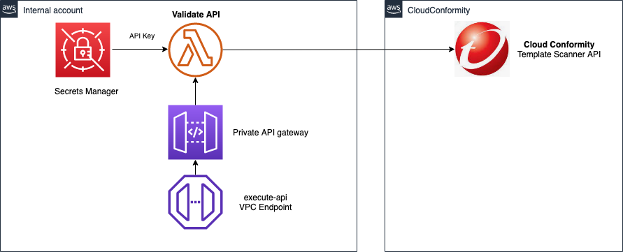
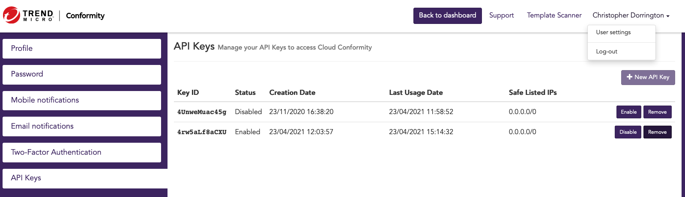
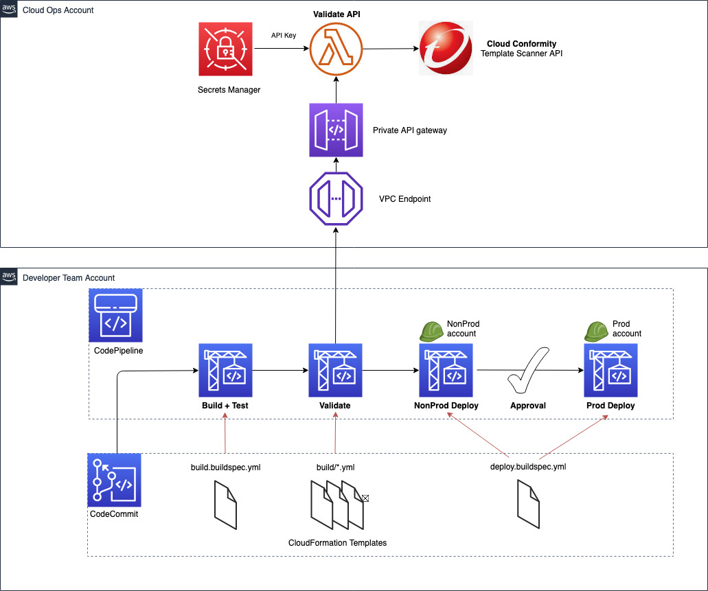
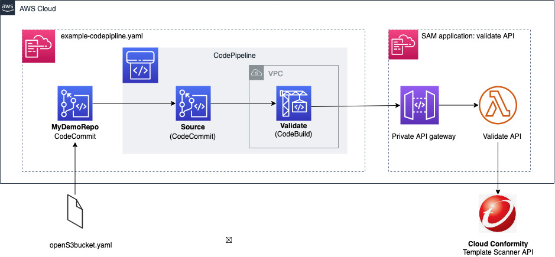

# A centralized API solution for AWS CloudFormation template scanning with Cloud Conformity

Integrating AWS CloudFormation template scanning into CI/CD pipelines is a perfect way to always catch security infringements before deployments occur. However, when the scanning tools used are external to the organization, such as [Trend Micro's Cloud One Conformity](https://www.trendmicro.com/en_au/business/products/hybrid-cloud/cloud-one-conformity.html) (formerly Cloud Conformity), implementing and enforcing this in a multi team, multi account environment can present some challenges.

This solution allows for using the [CloudConformity Template Scanner API](https://github.com/cloudconformity/documentation-api/blob/master/TemplateScanner.md) in your AWS CodePipeline. AWS CodeBuild will fail if any submitted templates return failed checks, and results are presented using [CodeBuild reports](https://docs.aws.amazon.com/codebuild/latest/userguide/test-reporting.html) feature 


## Architecture

This codebase will create a private API endpoint which can be used within your CI/CD pipeline CodeBuild job to submit AWS CloudFormation templates to it. The API will then use the Cloud Conformity Template Scanner API to perform vulnerability scans upon the cloudformation. By using the API caller's AWS account number, you can be sure that the checks performed are exactly the same as the Cloud Conformity real time scanning running against the destination account. 

Results from the API are returned in Cucumber JSON format, to enable easy viewing as part of CodeBuild test reports. 

A suggested CodeBuild buildspec file is also [included as part of this repository](./validate.buildspec.yml), to enable use within CodePipeline straight away.



### API endpoints provided

Endpoints for viewing and manipulating the Accounts that the Authenticated User
has permissions to access.

* [Scan templates with Cloud Conformity](docs/validate.post.md) : `POST /validate/`
* [Request exception to a failing check](docs/exceptions.post.md) : `POST /exceptions/`
* [Approve an exception request](docs/exceptions.put.md) : `PUT /exceptions/`
* [Delete an exception](docs/exceptions.md) : `DELETE /exceptions/`
* [List exceptions](docs.exceptions.md) : `GET /exceptions/`


## Installation

For ease of deployment, the architecture has been wrapped into an [AWS SAM](https://docs.aws.amazon.com/serverless-application-model/latest/developerguide/serverless-getting-started.html) application.

### Pre-requisites

- [SAM CLI installed](https://docs.aws.amazon.com/serverless-application-model/latest/developerguide/serverless-sam-cli-install.html)
- [AWS CLI installed](https://docs.aws.amazon.com/cli/latest/userguide/install-cliv2.html), and credentials set for the account to deploy to
- S3 bucket available to store SAM build artifacts
- CloudConformity account (to obtain API key, see below)

### Deployment via SAM

Update the [samconfig.toml](./samconfig.tml) with account specific parameters:

| Parameter | Description |
| :--------| :-----------|
| Stage | Set to `dev`, `prod` etc |
| CreateVPCEndpoint | Set to true to create an `execute-api` VPC endpoint |
| ExistingApiVPCEndpointId | If using an existing VPC endpoint, enter VPCE ID here |
| VpcIdParameter | Required if creating VPC endpoint, otherwise enter `n/a` | 
| VpcEndpointAllowedCIDRRange | If creating VPC endpoint, specify CIDR for access to the API, eg. `10.0.0.0\8` |
| VpcEndpointSubnetIdsParameter | If creating VPC endpoint, comma separated list of subnet IDs for the VPC endpoint

Build and Deploy:
- First build the app: 
  ```
  sam build --use-container
  ```
- Next, deploy the app: 
  ```bash
  sam deploy 
    --stack-name validation-api \
    --capabilities CAPABILITY_NAMED_IAM \
    --region <aws-region> \
    --s3-bucket <s3-bucket>
  ```

### Obtain Conformity API key

An API key from Cloud Conformity is required for the code to access the Template Scanner API. If you do not have one already, obtain one as follows:

Within the TrendMicro Cloud Conformity Console, log in with your user account and select *User Settings*. In the left navigation bar, select *API Keys*. At the top right of the API Keys screen, select *+New API Key*. Restrict the IP range if desired.



Once you have created the API Key, it displays in the Console under the Key ID with a status of *Enabled*.

### Store Conformity API key in AWS Secrets Manager

The SAM application has created an AWS Secrets Manager entry to store the Conformity API key.
- Using the AWS Console, navigate to AWS Secrets Manager
- Open the secret at `template-validator/<Stage>` (where Stage was defined within the `samconfig.toml` file)
- Click **Retrieve Secret Value** then **Edit**
- Enter the Conformity API key as the value for `api-key`

## Integrating inside CodeBuild

The purpose of this API is that it can be called from CI/CD builds to validate cfn templates before they are deployed. A CodeBuild stage called "Validate" can be used to iterate over AWS CloudFormation templates, and fail the build if Cloud Conformity checks are failing.

More information on Test Reporting inside AWS CodeBuild is available [here](https://docs.aws.amazon.com/codebuild/latest/userguide/test-reporting.html).

The buildspec file to be used is also contained within this repo:
- [validate.buildspec.yml](./validate.buildspec.yml)

This CodeBuild can then be used in AWS CodePipeline, as per the Validate stage in diagram below:



### Test using example CodePipeline

Whilst the above diagram shows a typical multi account and full CI/CD pipeline, for the purposes of testing a simpler environment is provided within this repository. This can be used to test the SAM validate-api deployment, and also show how the CodeBuild validate stage can be used within CodePipeline. 

The stack is defined in [example-codepipeline.yaml](./example-codepipeline.yaml).

#### Example CodePipeline Deployment



This stack is a AWS CloudFormation stack and can be quickly launched through the Console. 

As CodeBuild is running inside a VPC (to be able to access the private validate API), you will need to choose a VPC, Subnet and Security Group. The default VPC security group is suggested, as only outbound access is required. See "Notes on AWS CodeBuild inside VPC" section below for further information.

Alternatively, you can launch via the command line. For this method, you will need to provide the required VPC parameters via `--parameter-overrides` as per the command below:
```
aws cloudformation deploy \              
    --stack-name test-validate-pipeline \
    --template-file example-codepipeline.yaml \
    --capabilities CAPABILITY_NAMED_IAM \
    --parameter-overrides VpcId=<vpc-id> SubnetId=<subnet-id> SecurityGroupId=<security-group-id>
```

#### Triggering the CodePipeline

This stack will create a CodeCommit repository, and the CodePipeline will trigger on a commit to that repository. The repository is currently empty, so we need to add a file. The following command will add a CloudFormation template which defines an open S3 bucket. **NOTE** this stack and the S3 bucket within it will **not** get created in your account. It will only be picked up by CodePipeline and passed to the "Validate" CodeBuild stage, simulating your teams' CI/CD pipelines.

```
aws codecommit put-file --repository-name MyDemoRepo --branch-name main --file-content fileb://tests/payloads/openS3bucket.yaml --file-path build/openS3bucket.yaml --name "J Doe" --email "jdoe@example.com" --commit-message "commit to trigger pipeline"
```

The CodePipeline can be viewed in the Console. After a short while the pipeline will start.

#### View results

After a few minutes, the pipeline will fail. This is expected - the CodeBuild stage has picked up the public S3 bucket and sent to Cloud Conformity for scanning. Cloud Conformity will have alerted that there are VERY HIGH security risks with defining a public S3 bucket.

The full report can be viewed through the Console:

- Navigate to CodePipeline "ExampleCodePipelineWithTemplateValidationPhase"
- Click on *details* on CodeBuild stage
- Click *Reports* tab
- Click on the report in the *Report History* tab

You can now see all the Cloud Conformity errors relating to the template which was committed to the repository. 


In real life, this template can be the output of another *Build* CodeBuild stage, or another location within your repository.

### Notes on CodeBuild inside VPC

When configuring CodeBuild, to ensure it is able to access the private API gateway, it needs to be VPC attached. When choosing a subnet to place CodeBuild within, ensure that the private subnet has internet access via NAT gateway **OR** the following VPC endpoints are configured:

| Required VPC Endpoints |
| -------------|
| ssm |
| codebuild |
| git-codecommit |
| logs |
| s3 (gateway endpoint) |

## Development

This repository is provided as a working base for you to use within your own projects. If you have enchancements or bug fixes that will benefit future users of this code, please do raise an issue, or preferably a pull request. 

### Tests

Tests are defined in the `tests` folder in this project. Use pip to install the test dependencies and run tests.

Test can be executed by: 
```bash
# install both prod and dev packages
pip install -r requirements-dev.txt --user
pip install -r src/requirements.txt --user

# install the package in 'editable' mode
pip install -e . --user

# run tests
python -m pytest tests/unit -v
```